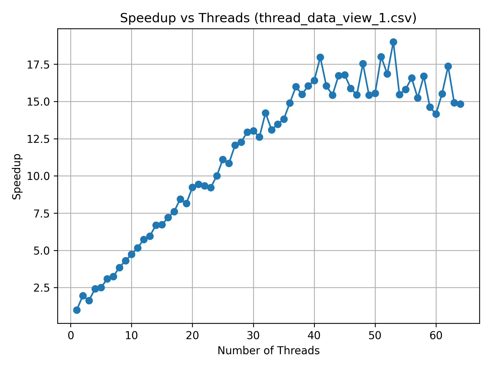
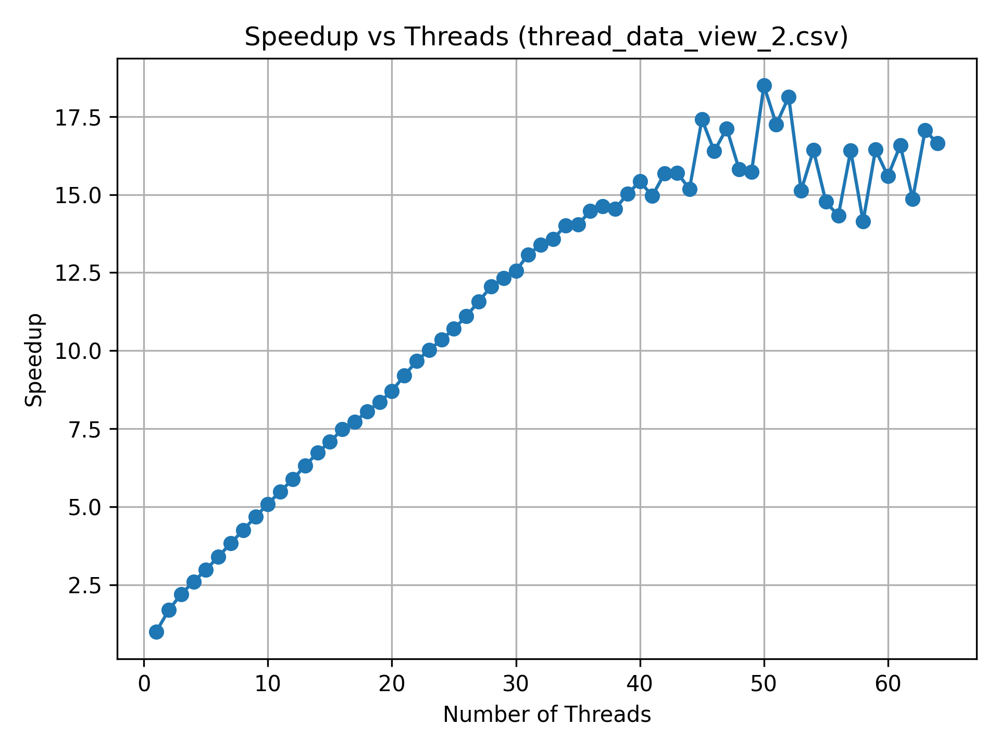
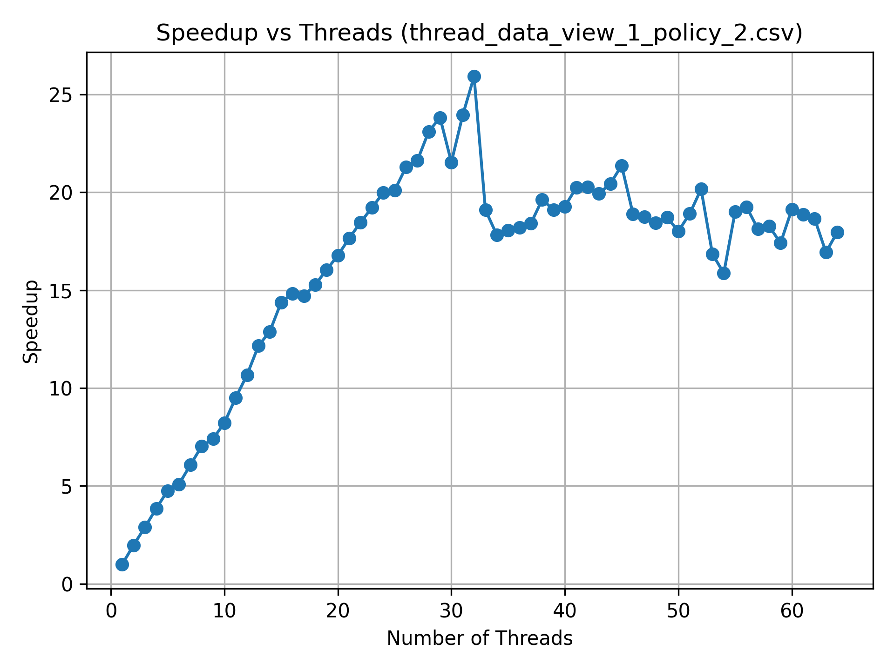
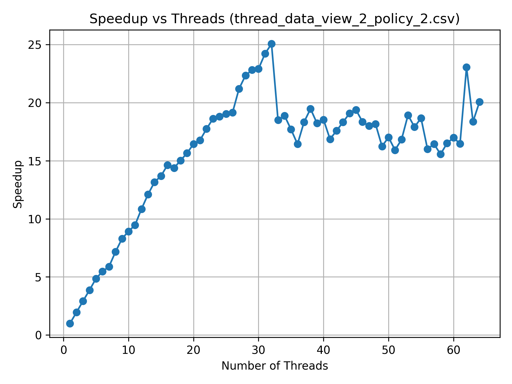

# Assignment 1 Writeup

## Problem 1

I observed a linear relationship between the number of threads used to compute
the set and the speedup in runtime needed to compute the set, up to about 40
threads. The system I am running this on has 16 cores and 32 threads. This
linear relationship was true for both views. This is because the majority of the
workload is inherently parallel. View 2 is more smooth in this linear
relationship, likely because the work is more evenly divided amongst the
different threads (there are no threads that get significantly more or less work
than average).




In both views the runtimes got volatile with diminishing returns on the speedup
after about 40 threads. This is almost certainly due to the cores being
saturated with work so using more threads does not extract more parallelism. 

The assignemnt mentions the three thread data point. And on view 1 I do indeed
see a datapoint that is less performant than two threads. My hypothesis for this
is that when the whole set is divided into three, the top and bottom parts of
the set have many datapoints are easily determined to be not in the set. However
the middle section has quite a lot of data points that take the maximum time to
compute their membership in the set. As a result most of the time computing the
set is in this one section vs with two threads where that work is shared.

Adding timing information to the threads, on view one indeed thread 1 (the
middle thread) always takes ~3x longer than thread 0 and 2:

```
time to run thread: 0: 48.050598ms
time to run thread: 2: 51.665116ms
time to run thread: 1: 146.751098ms
time to run thread: 0: 47.815946ms
time to run thread: 2: 53.470350ms
time to run thread: 1: 152.784136ms
time to run thread: 0: 46.619099ms
time to run thread: 2: 53.220529ms
time to run thread: 1: 152.330070ms
time to run thread: 0: 46.609820ms
time to run thread: 2: 53.161037ms
time to run thread: 1: 149.087925ms
time to run thread: 0: 46.593821ms
time to run thread: 2: 51.806202ms
time to run thread: 1: 150.446978ms
```

View 2 has a similar consistent imbalance between threads but is more balanced
than view 1:

```
time to run thread: 2: 37.946157ms
time to run thread: 1: 42.836281ms
time to run thread: 0: 64.867778ms
time to run thread: 2: 39.779195ms
time to run thread: 1: 41.073757ms
time to run thread: 0: 64.349290ms
time to run thread: 2: 38.700349ms
time to run thread: 1: 41.144339ms
time to run thread: 0: 64.124466ms
time to run thread: 1: 40.266984ms
time to run thread: 2: 40.904077ms
time to run thread: 0: 63.983319ms
time to run thread: 2: 37.308544ms
time to run thread: 1: 40.802855ms
time to run thread: 0: 63.856721ms
```

this confirms that specific segments of the set will take more time to compute
than others. A more ideal strategy might be to divide the work up into small
discreet chuncks and hand them out to threads in a thread pool. Smaller chunks
of work will make the units of work more evenly balanced, and if a thread
happens to get a chunk that takes significantly more time to compute, forward
progress can be made on the other chuncks on the other threads vs our current
solution which pre-determines what work each thread will permform.

However, that would require synchronization between the threads to coordiate
which thread is working on which unit of work. The problem asks for an
alternative static work assignment with no synchronization. An alternative might
be, instead of computing a contiguous block in each thread, have each thread
compute individual rows interleaved with each other. This might provide a more
fair distribution of work between the threads given the hypothesis that rows
near each other require similar amounts of time to compute. Here are the plots
of speedups for this strategy:




Excelent, we can see not only do we get a fair amount of additional speedup in
runtime, but we also see that at around 32 threads we reach diminishing returns
on speedup which, given we have 32 SMT threads on this machine, that means we
are achieving full saturation of all SMT threads. Any additional threads working
on the problem subtract from the runtime speedup due to oversaturation of the
CPU cores/threads.
